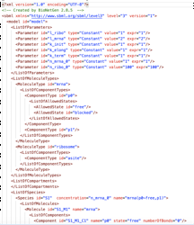
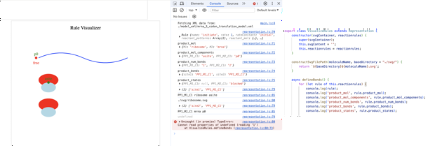

# NFSim Visualization

---

{width=100%}

---

- Ultimate goal: make a generalized web tool in JavaScript to visualize biological models generated by NFSim
- For now, I am using this simple model of mRNA translation

{width=50%}

---

# What I want to do in words

- Parse the XML file into a "Model object" that can be passed around to different functions/classes -> done
- The ReactionRules part of the model describes all the bonds, molecules, and components involved in the reaction, each step is a reaction (e.g. initiation = 1st rule, each elongation step is its own rule)
- For each Rule:
  - For each interacting molecule, pull its SVG file
  - Go through its attributes to see what it's meant to do (what other molecule it bonds with, which sites bond)
  - Place it somewhere on the screen
- Current issue: how/what to pass through each function so that the end result is two molecules on the screen moving toward each other?
  - Perhaps have each interacting molecule's info stored as a class (e.g. where bonds/sites are stored as attributes), and pass these classes into a visualizing function where all the SVG files get pulled and placed on the screen
  - Retain those positions, because the next rule/step needs to move from there

---

{width=150%}